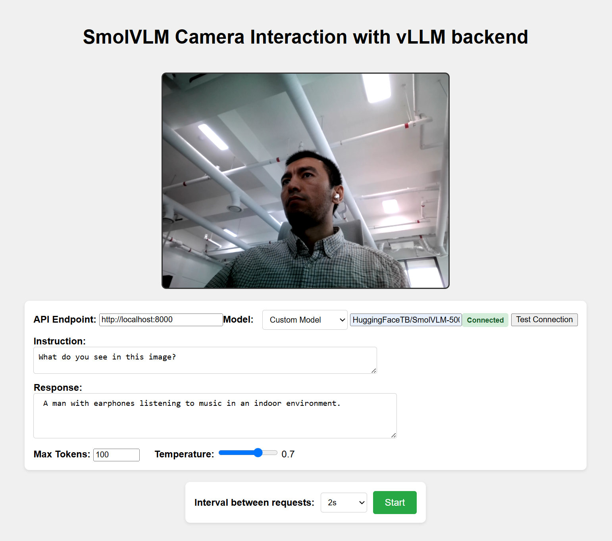

# smolvlm-realtime-webcam-vllm

<div align="center">
    
</div>

Real-time webcam demo using [SmolVLM](https://huggingface.co/HuggingFaceTB/SmolVLM-500M-Instruct) with a [vLLM](https://github.com/vllm-project/vllm) backend.

The app captures webcam images in the browser, sends them with a text prompt to a local vLLM server via OpenAI-compatible API, and displays the model’s visual-language response.

## How to Set Up

Follow these steps to get the real-time SmolVLM webcam demo running with a local vLLM server:

---

### 1. Clone the Repository

```bash
git clone https://github.com/yourusername/smolvlm-realtime-webcam-vllm.git
cd smolvlm-realtime-webcam-vllm
```

### 2. Set Up the vLLM Backend

#### vLLM Installation (GPU)

```bash
# (Recommended) Create a new conda environment.
conda create -n vllm python=3.12 -y
conda activate vllm

# Install vLLM
pip install vllm
```

Or see full installation instructions in the [vLLM documentation](https://docs.vllm.ai/en/stable/getting_started/installation/gpu.html).

#### Start the vLLM Server

Run the vLLM server using the provided shell script:

```bash
bash vllm_backend.sh
```

Default model: `HuggingFaceTB/SmolVLM-500M-Instruct`

Tested:

- `HuggingFaceTB/SmolVLM-500M-Instruct`
- `HuggingFaceTB/SmolVLM-256M-Instruct`
- `HuggingFaceTB/SmolVLM-Instruct`

If you want to use a different model, pass the model name as an argument:

```bash
bash vllm_backend.sh your-org/your-model-name
```

> Note
> ℹ️ Make sure the model is compatible with vLLM and supports the OpenAI Chat API format.

The script will automatically fall back to the default model if no argument is provided.

### 3. Launch the Frontend

Open `demo.html` on a browser and allow access to webcam. Done!

Tested using RTX 4090

## Reference

- Inspired by [http://github.com/ngxson/smolvlm-realtime-webcam](http://github.com/ngxson/smolvlm-realtime-webcam) repository.
